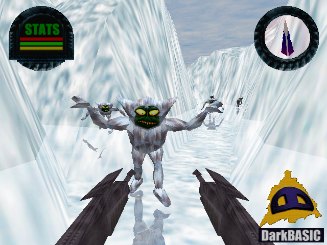
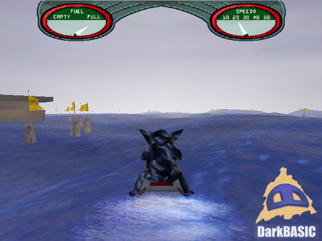
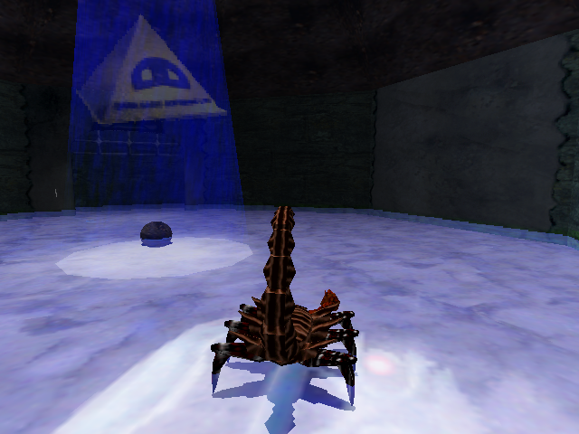
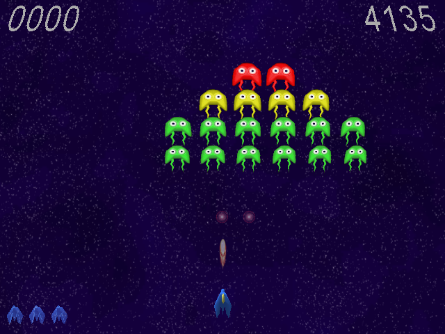
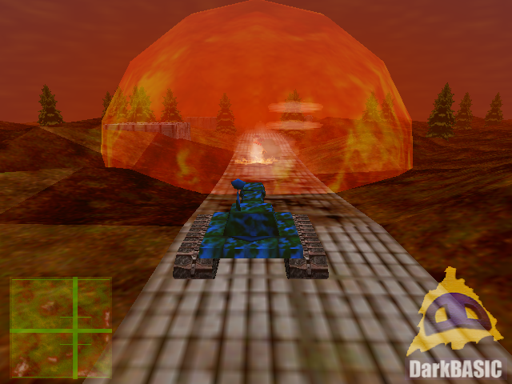

# DarkBASIC-Example-Projects
Example projects from 3D Game Creator DarkBASIC 1.09B

This archive contains all 5 example projects from DarkBASIC Software 3D Game Creator (v1.09B).

All original code from [Lee Bamber](https://github.com/LeeBamberTGC) - written in 2000

## Projects listed
- <code>iced</code> : a FPS demo in an icy mountain environment 
 

- <code>jetski</code> : a jetski driving experience on a pretty well simulated sea 
 

- <code>room</code> : starting point of a donjon exploration 
 

- <code>swarm</code> : basically a Space Invaders game 
 

- <code>tank</code> : starting point of a tank war game 
 
